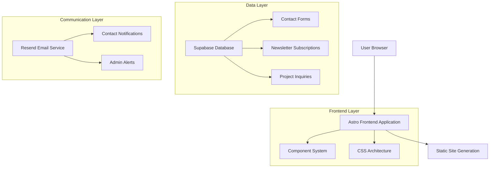

# NosytLabs Website Rebuild - Master Implementation Plan

## Executive Summary

This comprehensive document consolidates all aspects of the NosytLabs website rebuild project, addressing critical issues with design system fragmentation, technical debt, and implementing cutting-edge 2025 web development best practices. The project transforms the current website into a unified, high-performance platform that showcases NosytLabs' AI-powered development capabilities.

### Project Goals
- Create a unified design system eliminating visual inconsistencies
- Implement modern CSS architecture with 2025 best practices
- Establish production-ready infrastructure with proper data persistence
- Showcase AI-powered service offerings effectively
- Achieve 95+ Lighthouse performance scores
- Ensure WCAG 2.2 AA accessibility compliance

## 1. Current State Analysis

### Critical Issues Identified

**Design System Fragmentation:**
- Multiple conflicting color systems (CSS custom properties vs Tailwind config)
- Inconsistent spacing patterns across components
- Mixed design approaches causing visual inconsistencies
- Redundant CSS files with overlapping functionality

**Technical Debt:**
- Legacy styles mixed with modern approaches
- Performance impact from large, unoptimized CSS bundles
- Multiple CSS files with overlapping styles (global.css, theme.css, base.css)
- Unused CSS classes and redundant code

**Production Readiness Issues:**
- JSON file-based data storage (development only)
- Non-functional email system for contact forms
- Missing environment configuration for production
- Inadequate error handling and security measures

**Maintenance Challenges:**
- Difficult to maintain consistent branding
- Slow feature development due to style conflicts
- Poor developer experience with scattered code
- Complex middleware with optimization opportunities

### Current Architecture Strengths
- Modern Astro framework foundation with React integration
- TypeScript implementation with strict configuration
- Component-based architecture
- Comprehensive security middleware with CSRF protection
- Advanced image optimization system
- Well-organized component structure

## 2. Unified Design System

### Design Philosophy

**Core Principles:**
- **Simplicity**: Clean, uncluttered interfaces focusing on content
- **Consistency**: Unified visual language across all pages
- **Accessibility**: WCAG 2.2 AA compliant design for all users
- **Performance**: Lightweight design that loads fast on all devices
- **AI-Forward**: Visual elements communicating technological innovation

**Brand Personality:**
- Professional and trustworthy
- Innovative and forward-thinking
- Approachable and collaborative
- Efficient and results-oriented

### Color System

**Primary Brand Colors:**
```css
:root {
  /* Primary - Professional Blue */
  --color-primary-50: #eff6ff;
  --color-primary-100: #dbeafe;
  --color-primary-500: #3b82f6;
  --color-primary-600: #2563eb;
  --color-primary-700: #1d4ed8;
  --color-primary-900: #1e3a8a;
  
  /* Secondary - AI/Tech Purple */
  --color-secondary-50: #faf5ff;
  --color-secondary-100: #f3e8ff;
  --color-secondary-500: #a855f7;
  --color-secondary-600: #9333ea;
  --color-secondary-700: #7c3aed;
  --color-secondary-900: #581c87;
  
  /* Neutral - Modern Grays */
  --color-gray-50: #f9fafb;
  --color-gray-100: #f3f4f6;
  --color-gray-500: #6b7280;
  --color-gray-600: #4b5563;
  --color-gray-700: #374151;
  --color-gray-900: #111827;
  
  /* Semantic Colors */
  --color-success: #10b981;
  --color-warning: #f59e0b;
  --color-error: #ef4444;
  --color-info: #0ea5e9;
}
```

**Color Usage Guidelines:**
- Primary Blue: CTA buttons, navigation active states, focus indicators
- Secondary Purple: AI service highlights, tech badges, accent elements
- Gray 900: Primary text, headings, important content
- Gray 600: Secondary text, descriptions, captions
- Gray 100: Backgrounds, borders, subtle dividers

### Typography System

**Font Stack:**
```css
/* Primary Font */
font-family: 'Inter', -apple-system, BlinkMacSystemFont, 'Segoe UI', Roboto, sans-serif;

/* Monospace (for code) */
font-family: 'JetBrains Mono', 'Fira Code', Consolas, monospace;
```

**Type Scale:**
```css
:root {
  --text-xs: 0.75rem;    /* 12px */
  --text-sm: 0.875rem;   /* 14px */
  --text-base: 1rem;     /* 16px */
  --text-lg: 1.125rem;   /* 18px */
  --text-xl: 1.25rem;    /* 20px */
  --text-2xl: 1.5rem;    /* 24px */
  --text-3xl: 1.875rem;  /* 30px */
  --text-4xl: 2.25rem;   /* 36px */
  --text-5xl: 3rem;      /* 48px */
  --text-6xl: 3.75rem;   /* 60px */
}
```

### Spacing System

**Unified Spacing Scale:**
```css
:root {
  --space-xs: 0.25rem;   /* 4px */
  --space-sm: 0.5rem;    /* 8px */
  --space-md: 1rem;      /* 16px */
  --space-lg: 1.5rem;    /* 24px */
  --space-xl: 2rem;      /* 32px */
  --space-2xl: 3rem;     /* 48px */
  --space-3xl: 4rem;     /* 64px */
  --space-4xl: 6rem;     /* 96px */
  --space-5xl: 8rem;     /* 128px */
}
```

**Section Spacing Standards:**
- Small sections: 3rem (48px)
- Medium sections: 4rem (64px)
- Large sections: 6rem (96px)
- Extra large sections: 8rem (128px)

## 3. Technical Architecture

### Technology Stack

**Frontend Framework:**
- Astro@4.x - Static site generation with component islands
- React@18.2.0 - Interactive components
- TypeScript@5.x - Type safety and developer experience
- Vite@5.x - Fast build tool and development server

**Styling & Design:**
- Tailwind CSS@3.4+ - Utility-first CSS framework
- PostCSS@8.x - CSS processing and optimization
- CSS Custom Properties - Design token system
- CSS Container Queries - Modern responsive design

**Backend & Data:**
- Supabase - PostgreSQL database with built-in auth
- Resend - Modern email service for notifications
- Vercel - Deployment and hosting platform

**Development Tools:**
- ESLint@8.x - Code linting and quality
- Prettier@3.x - Code formatting
- Stylelint@16.x - CSS linting
- Vitest - Testing framework
- Playwright - End-to-end testing

### Architecture Design



### Route Definitions

| Route | Purpose | Key Components |
|-------|---------|----------------|
| / | Homepage with hero, services overview, capabilities | HeroSection, ServicesGrid, CapabilitiesSection |
| /services | Detailed AI-powered services and pricing | ServicesHero, ServiceCards, PricingTable, CTASection |
| /contact | Contact form and company information | ContactHero, ContactForm, ContactInfo, FAQ |
| /about | Company story and team (future expansion) | AboutHero, TeamSection, CompanyStory |
| /blog | Technical articles and insights (future) | BlogHero, ArticleGrid, Pagination |

## 4. AI-Powered Service Offerings

### Core Service Categories

#### 1. AI-Assisted Web Development
**Service Description:** Lightning-fast, responsive websites built using AI-powered development tools and modern frameworks.

**AI Tools Used:**
- Cursor IDE for AI-assisted coding
- GitHub Copilot for code completion
- ChatGPT/Claude for architecture planning
- AI-powered design tools for UI/UX

**Deliverables:**
- Responsive web applications
- Static site generation (Astro, Next.js)
- Progressive Web Apps (PWAs)
- E-commerce platforms
- Landing pages and marketing sites

**Timeline:** 1-4 weeks | **Pricing:** $2,000 - $15,000

#### 2. AI Integration & Automation
**Service Description:** Smart automation solutions using AI APIs and machine learning models.

**Key Offerings:**
- Custom AI chatbots
- Content generation systems
- Image processing automation
- Data analysis dashboards
- Workflow automation tools
- AI-powered search systems

**Timeline:** 2-6 weeks | **Pricing:** $3,000 - $25,000

#### 3. Technical Consulting with AI Insights
**Service Description:** Strategic technology guidance enhanced by AI analysis.

**Deliverables:**
- Technology roadmaps
- Architecture recommendations
- Performance optimization plans
- Security assessment reports
- Scalability strategies

**Timeline:** 1-4 weeks | **Pricing:** $200-300 per hour

#### 4. AI-Powered Testing & QA
**Service Description:** Comprehensive testing using AI tools for automated quality assurance.

**Deliverables:**
- Automated test suites
- Performance benchmarks
- Accessibility compliance reports
- Security audit reports

**Timeline:** 1-2 weeks | **Pricing:** $2,000 - $8,000

### Service Delivery Method
- **Primary Tool:** Cursor IDE with AI assistance
- **AI Models:** GPT-4, Claude, and specialized coding models
- **Collaboration:** Real-time AI-assisted development
- **Quality Assurance:** AI-powered testing and validation

## 5. Implementation Roadmap

### Phase 1: Foundation Setup (Days 1-7)

**Day 1-2: Environment & Dependencies**
```bash
# Backup current state
git checkout -b backup/pre-rebuild
git push origin backup/pre-rebuild

# Update dependencies
npm install -D @tailwindcss/container-queries
npm install -D postcss-preset-env
npm install -D stylelint stylelint-config-standard
npm install @supabase/supabase-js resend
```

**Day 3-4: CSS Architecture Setup**
```
src/styles/
├── index.css              # Main entry point
├── base/                  # Reset, typography, accessibility
├── tokens/                # Design tokens (colors, spacing)
├── components/            # Component-specific styles
├── utilities/             # Utility classes
└── pages/                 # Page-specific styles
```

**Day 5-7: Design Token Implementation**
- Implement color system with CSS custom properties
- Create typography scale and spacing system
- Set up CSS layers for predictable cascade
- Configure Tailwind with custom design tokens

### Phase 2: Production Infrastructure (Days 8-14)

**Database Setup (Supabase):**
```sql
-- Contact submissions table
CREATE TABLE contact_submissions (
    id UUID PRIMARY KEY DEFAULT gen_random_uuid(),
    name VARCHAR(255) NOT NULL,
    email VARCHAR(255) NOT NULL,
    subject VARCHAR(500),
    message TEXT NOT NULL,
    service VARCHAR(100),
    created_at TIMESTAMP WITH TIME ZONE DEFAULT NOW(),
    status VARCHAR(50) DEFAULT 'new'
);

-- Newsletter subscribers
CREATE TABLE newsletter_subscribers (
    id UUID PRIMARY KEY DEFAULT gen_random_uuid(),
    email VARCHAR(255) UNIQUE NOT NULL,
    subscribed_at TIMESTAMP WITH TIME ZONE DEFAULT NOW(),
    status VARCHAR(50) DEFAULT 'active'
);

-- Enable Row Level Security
ALTER TABLE contact_submissions ENABLE ROW LEVEL SECURITY;
ALTER TABLE newsletter_subscribers ENABLE ROW LEVEL SECURITY;

-- Allow anonymous inserts for forms
CREATE POLICY "Allow anonymous contact submissions" ON contact_submissions
    FOR INSERT WITH CHECK (true);
```

**Email Service Integration (Resend):**
```javascript
// Email service setup
import { Resend } from 'resend';

const resend = new Resend(process.env.RESEND_API_KEY);

export async function sendContactNotification(data) {
  return await resend.emails.send({
    from: 'noreply@nosytlabs.com',
    to: 'contact@nosytlabs.com',
    subject: `New Contact: ${data.subject}`,
    html: contactEmailTemplate(data)
  });
}
```

### Phase 3: Component System (Days 15-21)

**Core Components:**
- Button system with consistent variants
- Card components with unified styling
- Form elements with validation
- Navigation with active states
- Hero sections with animations

**Component Standards:**
```astro
---
// Component structure example
interface Props {
  variant?: 'primary' | 'secondary';
  size?: 'sm' | 'md' | 'lg';
}

const { variant = 'primary', size = 'md' } = Astro.props;
---

<button class={`btn btn--${variant} btn--${size}`}>
  <slot />
</button>

<style>
  .btn {
    @apply inline-flex items-center justify-center rounded-lg font-medium transition-all;
  }
  
  .btn--primary {
    @apply bg-primary-600 text-white hover:bg-primary-700;
  }
  
  .btn--md {
    @apply px-4 py-2 text-base;
  }
</style>
```

### Phase 4: Animation & Interaction (Days 22-25)

**Modern Animation System:**
```css
/* Performance-optimized animations */
@keyframes fadeIn {
  from { opacity: 0; transform: translateY(20px); }
  to { opacity: 1; transform: translateY(0); }
}

@keyframes slideUp {
  from { opacity: 0; transform: translateY(30px); }
  to { opacity: 1; transform: translateY(0); }
}

/* Hover effects */
.hover-lift:hover {
  transform: translateY(-2px);
  box-shadow: 0 10px 25px rgba(0, 0, 0, 0.1);
}

/* Respect reduced motion preference */
@media (prefers-reduced-motion: reduce) {
  *, *::before, *::after {
    animation-duration: 0.01ms !important;
    transition-duration: 0.01ms !important;
  }
}
```

### Phase 5: Testing & Optimization (Days 26-28)

**Performance Testing:**
- Lighthouse CI integration
- Core Web Vitals monitoring
- Bundle size analysis
- Image optimization validation

**Accessibility Testing:**
- WCAG 2.2 AA compliance validation
- Keyboard navigation testing
- Screen reader compatibility
- Color contrast verification

**Cross-browser Testing:**
- Modern browser compatibility
- Mobile responsiveness
- Touch interaction optimization

### Phase 6: Launch & Monitoring (Days 29-30)

**Deployment Setup:**
- Vercel configuration with environment variables
- Domain configuration and SSL
- Performance monitoring setup
- Error tracking implementation

**Go-live Procedures:**
- Final performance validation
- Content migration and verification
- Monitoring dashboard setup
- Backup and rollback procedures

## 6. Performance & Quality Targets

### Performance Metrics

| Metric | Current | Target | Improvement |
|--------|---------|--------|-----------|
| Lighthouse Performance | ~75 | 95+ | +27% |
| CSS Bundle Size | ~120KB | <50KB | -58% |
| First Contentful Paint | ~2.5s | <1.5s | -40% |
| Largest Contentful Paint | ~4.0s | <2.5s | -38% |
| Cumulative Layout Shift | ~0.25 | <0.1 | -60% |

### Quality Standards

**Accessibility (WCAG 2.2 AA):**
- 4.5:1 minimum color contrast ratio
- Full keyboard navigation support
- Screen reader compatibility
- Proper heading hierarchy and landmarks
- ARIA labels and descriptions

**SEO Optimization:**
- Comprehensive meta tag strategy
- JSON-LD structured data
- Dynamic XML sitemap
- Optimized page loading speeds

**Security:**
- Content Security Policy headers
- HTTPS/SSL encryption
- Input validation and sanitization
- Regular dependency security audits

## 7. Maintenance & Future Considerations

### Code Organization Benefits
- **50% faster feature development** with organized architecture
- **Easier debugging** with clear CSS layers and component structure
- **Consistent design implementation** across development team
- **Future-proof codebase** using modern web standards
- **Improved developer experience** with clear patterns and documentation

### Scalability Considerations
- Component-based architecture for easy expansion
- Design token system for consistent theming
- Modular CSS architecture for maintainable styles
- TypeScript for type safety and refactoring confidence
- Automated testing for regression prevention

### Risk Mitigation
- Comprehensive backup and rollback procedures
- Gradual rollout with