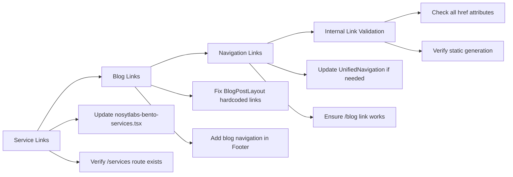

# NosytLabs Navigation & Dynamic Routing Implementation Plan

## **Project Overview**
Establish seamless modular navigation pathways compatible with NosytLabs' architectural patterns for optimal SEO and user flow. This plan addresses missing route targets, client-side interactivity gaps, and implements dynamic routing while maintaining Astro's server-first architecture with selective hydration.

## **Current State Analysis**

### ✅ Strengths
- Astro static site with React components for interactivity
- Well-structured `BentoCard` component for service display
- Unified navigation system already in place
- SEO-optimized configuration with static output

### ❌ Issues to Address
- Missing dynamic service detail pages (`/services/web-development`, etc.)
- No blog structure or dynamic blog routes
- Hardcoded links in `BlogPostLayout.astro`
- Service hrefs in `nosytlabs-bento-services.tsx` point to non-existent pages
- Potential ServiceModal component references to clean up

## **Implementation Strategy**

```mermaid
graph TB
    A[Phase 1: Data Structure] --> B[Phase 2: Dynamic Service Routes]
    B --> C[Phase 3: Blog Infrastructure]
    C --> D[Phase 4: Link Integration]
    D --> E[Phase 5: SEO & Testing]

    A --> A1[Create service data config]
    A --> A2[Create blog data config]
    A --> A3[Add path resolver utilities]
    
    B --> B1[Create /services/[name].astro]
    B --> B2[Update nosytlabs-bento-services.tsx]
    B --> B3[Implement static path generation]
    
    C --> C1[Create /blog/index.astro]
    C --> C2[Create /blog/[slug].astro]
    C --> C3[Update BlogPostLayout.astro]
    
    D --> D1[Update navigation hrefs]
    D --> D2[Validate all internal links]
    D --> D3[Remove ServiceModal references]
    
    E --> E1[Add meta tags & SEO]
    E --> E2[Test static generation]
    E --> E3[Verify all routes work]
```

## **Phase 1: Data Structure & Configuration**

### 1.1 Service Data Configuration
**File**: `src/config/services.ts`

Create centralized service data structure:
```typescript
export interface ServiceData {
  name: string;
  slug: string;
  description: string;
  shortDescription: string;
  price: string;
  timeline: string;
  features: string[];
  icon: any;
  category: string;
  metadata: {
    title: string;
    description: string;
    keywords: string[];
  };
}

export const services: ServiceData[] = [
  {
    name: "AI-Enhanced Web Development",
    slug: "web-development",
    description: "Lightning-fast websites built with AI assistance...",
    shortDescription: "Professional web development with AI optimization",
    price: "Starting at $2,999",
    timeline: "2-4 weeks",
    features: [
      "Custom design and development",
      "AI-powered performance optimization",
      "SEO-ready architecture",
      "Mobile-first responsive design"
    ],
    // ... additional properties
  },
  // ... other services
];
```

### 1.2 Blog Data Configuration
**File**: `src/config/blog.ts`

```typescript
export interface BlogPost {
  title: string;
  slug: string;
  excerpt: string;
  content: string;
  publishDate: Date;
  author: string;
  tags: string[];
  featuredImage?: string;
  metadata: {
    title: string;
    description: string;
    keywords: string[];
  };
}

export const blogPosts: BlogPost[] = [
  {
    title: "AI Trends to Watch in 2025",
    slug: "ai-trends-2025",
    excerpt: "Discover the latest AI trends shaping the future...",
    // ... additional properties
  },
  // ... other blog posts
];
```

### 1.3 Path Resolver Utilities
**File**: `src/utils/pathResolvers.ts`

```typescript
export const getServicePath = (serviceName: string): string => 
  `/services/${serviceName.toLowerCase().replace(/\s+/g, '-').replace(/[^a-z0-9-]/g, '')}`;

export const getBlogPath = (slug: string): string => `/blog/${slug}`;

export const generateSlug = (text: string): string =>
  text.toLowerCase().replace(/\s+/g, '-').replace(/[^a-z0-9-]/g, '');
```

## **Phase 2: Dynamic Service Routes**

### 2.1 Service Detail Pages
**File**: `src/pages/services/[name].astro`

```astro
---
import type { GetStaticPaths } from 'astro';
import { services } from '@/config/services';
import BaseLayout from '@/layouts/BaseLayout.astro';
import ContactForm from '@/components/forms/ContactForm.astro';

export const getStaticPaths: GetStaticPaths = () => {
  return services.map(service => ({
    params: { name: service.slug },
    props: { service }
  }));
};

const { service } = Astro.props;
---

<BaseLayout 
  title={service.metadata.title}
  description={service.metadata.description}
>
  <!-- Service detail content with pricing, features, timeline -->
  <section class="hero-section">
    <h1>{service.name}</h1>
    <p>{service.description}</p>
  </section>
  
  <section class="pricing-features">
    <!-- Pricing and features display -->
  </section>
  
  <section class="contact-section">
    <ContactForm serviceType={service.name} />
  </section>
</BaseLayout>
```

### 2.2 Service Navigation Updates
**File**: `src/components/marketing/nosytlabs-bento-services.tsx`

Update to use programmatic path resolvers:
```typescript
import { getServicePath } from '@/utils/pathResolvers';

// Replace hardcoded hrefs:
const services = [
  {
    name: "AI-Enhanced Web Development",
    href: getServicePath("AI-Enhanced Web Development"), // becomes "/services/web-development"
    // ... other properties
  },
  // ... other services
];
```

## **Phase 3: Blog Infrastructure**

### 3.1 Blog Landing Page
**File**: `src/pages/blog/index.astro`

```astro
---
import { blogPosts } from '@/config/blog';
import BaseLayout from '@/layouts/BaseLayout.astro';
import Card from '@/components/core/Card.astro';

const sortedPosts = blogPosts.sort((a, b) => 
  new Date(b.publishDate).getTime() - new Date(a.publishDate).getTime()
);
---

<BaseLayout title="Blog | NosytLabs" description="Latest insights and articles">
  <section class="blog-grid">
    {sortedPosts.map(post => (
      <Card
        title={post.title}
        content={post.excerpt}
        href={`/blog/${post.slug}`}
        contentType="blog"
      />
    ))}
  </section>
</BaseLayout>
```

### 3.2 Dynamic Blog Posts
**File**: `src/pages/blog/[slug].astro`

```astro
---
import type { GetStaticPaths } from 'astro';
import { blogPosts } from '@/config/blog';
import BlogPostLayout from '@/layouts/BlogPostLayout.astro';

export const getStaticPaths: GetStaticPaths = () => {
  return blogPosts.map(post => ({
    params: { slug: post.slug },
    props: { post }
  }));
};

const { post } = Astro.props;
---

<BlogPostLayout 
  title={post.metadata.title}
  description={post.metadata.description}
  publishDate={post.publishDate}
  author={post.author}
>
  <article>
    <h1>{post.title}</h1>
    <div set:html={post.content} />
  </article>
</BlogPostLayout>
```

### 3.3 Blog Layout Fixes
**File**: `src/layouts/BlogPostLayout.astro`

Replace hardcoded links with dynamic ones:
```astro
<!-- Replace hardcoded links like: -->
<!-- <a href="/blog/ai-trends-2025">AI Trends to Watch in 2025</a> -->

<!-- With dynamic links: -->
{blogPosts.map(post => (
  <a href={`/blog/${post.slug}`}>{post.title}</a>
))}
```

## **Phase 4: Link Integration & Validation**



### 4.1 Navigation Component Updates
- Verify `src/components/navigation/UnifiedNavigation.astro` includes blog link
- Update `src/components/layout/Footer.astro` blog link to point to `/blog`
- Ensure all navigation uses consistent routing patterns

### 4.2 ServiceModal Cleanup
- Remove any ServiceModal component references from `nosytlabs-bento-services.tsx`
- Clean up unused modal-related imports or code

### 4.3 Link Validation Checklist
- [ ] All service cards link to `/services/[slug]` pages
- [ ] Blog posts link to `/blog/[slug]` pages
- [ ] Navigation menu includes working blog link
- [ ] Footer links are functional
- [ ] No 404 errors on internal links

## **Phase 5: SEO Optimization & Testing**

### 5.1 SEO Enhancement
**Meta Tags**: Add to each dynamic page
```astro
<head>
  <title>{service.metadata.title}</title>
  <meta name="description" content={service.metadata.description} />
  <meta name="keywords" content={service.metadata.keywords.join(', ')} />
  <meta property="og:title" content={service.metadata.title} />
  <meta property="og:description" content={service.metadata.description} />
  <link rel="canonical" href={`https://nosytlabs.com/services/${service.slug}`} />
</head>
```

**Structured Data**: Add JSON-LD for services
```astro
<script type="application/ld+json" set:html={JSON.stringify({
  "@context": "https://schema.org",
  "@type": "Service",
  "name": service.name,
  "description": service.description,
  "provider": {
    "@type": "Organization",
    "name": "NosytLabs"
  }
})} />
```

### 5.2 Static Generation Verification
```bash
# Test build process
npm run build

# Verify all routes generate correctly
# Check dist/ folder for generated pages
ls dist/services/
ls dist/blog/
```

### 5.3 Performance Testing
- Lighthouse audit for new pages
- Core Web Vitals verification
- Mobile responsiveness testing
- Internal link crawling

## **File Structure After Implementation**

```
src/
├── config/
│   ├── services.ts              # Service data configuration
│   └── blog.ts                  # Blog data configuration
├── pages/
│   ├── services/
│   │   └── [name].astro         # Dynamic service pages
│   └── blog/
│       ├── index.astro          # Blog landing page
│       └── [slug].astro         # Dynamic blog posts
├── utils/
│   └── pathResolvers.ts         # URL generation utilities
└── components/
    └── marketing/
        └── nosytlabs-bento-services.tsx  # Updated with dynamic hrefs
```

## **Implementation Benefits**

### ✅ SEO Optimized
- Static generation with proper meta tags
- Structured data for better search visibility
- Canonical URLs and OpenGraph tags

### ✅ Maintainable
- Centralized data configuration
- Consistent URL patterns
- Easy to add new content

### ✅ Scalable
- Dynamic routing supports unlimited services/posts
- Reusable components and layouts
- Type-safe data structures

### ✅ Performance
- Astro's static-first approach maintained
- Selective hydration for interactivity
- Optimized build output

### ✅ User Experience
- Consistent navigation patterns
- Fast loading times
- Mobile-responsive design

## **Quality Assurance Checklist**

### Pre-Implementation
- [ ] Backup current codebase
- [ ] Review all existing hrefs and navigation
- [ ] Identify all hardcoded links to replace

### During Implementation
- [ ] Test each phase incrementally
- [ ] Verify static generation after each change
- [ ] Check for TypeScript errors
- [ ] Validate component prop types

### Post-Implementation
- [ ] Run full build and test locally
- [ ] Verify all internal links work
- [ ] Test responsive design on multiple devices
- [ ] Run Lighthouse audits
- [ ] Check for console errors
- [ ] Validate HTML and accessibility

## **Rollback Plan**

If issues arise during implementation:
1. Revert to previous commit using Git
2. Identify specific problematic changes
3. Implement fixes incrementally
4. Re-test each component individually

---

**Next Steps**: Switch to Code mode to begin implementation of this plan, starting with Phase 1 data configuration.