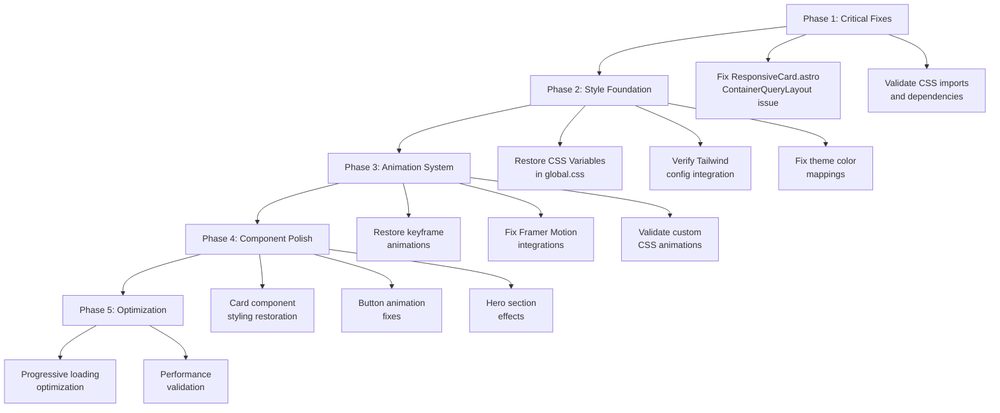
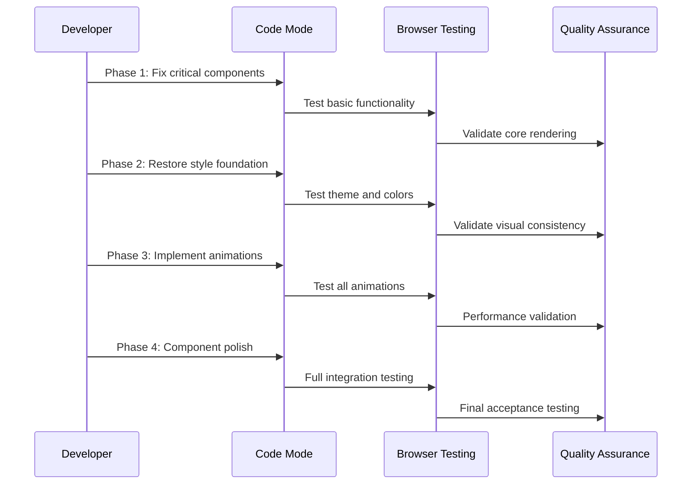

# NosytLabs Styling & Animation Restoration Plan

**Project:** NosytLabs Astro Website  
**Issue:** Comprehensive styling and animation restoration needed  
**Date:** January 7, 2025  
**Architect:** Kilo Code  

## Executive Summary

Your NosytLabs project has solid infrastructure in place, but requires comprehensive restoration of styling and animations. This plan addresses both structural issues (missing components) and potential rendering problems through systematic resolution across 5 implementation phases.

**Key Findings:**
- ✅ Core layout system intact ([`BaseLayout.astro`](src/layouts/BaseLayout.astro), [`UnifiedNavigation.astro`](src/components/navigation/UnifiedNavigation.astro), [`Footer.astro`](src/components/layout/Footer.astro))
- ✅ Component architecture functional ([`Hero.astro`](src/components/Hero.astro), [`Card.astro`](src/components/core/Card.astro), [`ProjectGrid.astro`](src/components/content/ProjectGrid.astro))
- ✅ Marketing components available ([`nosytlabs-bento-services.tsx`](src/components/marketing/nosytlabs-bento-services.tsx), [`bento-grid.tsx`](src/components/marketing/bento-grid.tsx))
- ✅ Comprehensive styling system present ([`global.css`](src/styles/global.css), [`tailwind.config.js`](tailwind.config.js))
- 🔴 **CRITICAL:** ResponsiveCard component references non-existent `<ContainerQueryLayout>`
- 🟡 **MEDIUM:** Styling and animation functionality compromised

## Detailed Restoration Strategy



## Phase-by-Phase Implementation

### **Phase 1: Critical Infrastructure Fixes** 🔧
**Priority: CRITICAL** | **Estimated Time: 2-3 hours**

#### 1.1 Fix ResponsiveCard.astro Component
**File:** [`src/components/core/ResponsiveCard.astro`](src/components/core/ResponsiveCard.astro)  
**Issue:** Line 36 references `<ContainerQueryLayout>` which doesn't exist

**Actions:**
- [ ] Remove or replace `<ContainerQueryLayout>` component
- [ ] Implement container query functionality directly in component
- [ ] Ensure responsive breakpoints work correctly
- [ ] Test responsive behavior across device sizes

#### 1.2 Validate Import Dependencies
**Files:** [`src/styles/global.css`](src/styles/global.css), [`astro.config.mjs`](astro.config.mjs)

**Actions:**
- [ ] Check all `@import` statements in global.css
- [ ] Verify Tailwind integration in astro.config.mjs
- [ ] Confirm CSS assets are loading properly
- [ ] Test build process for missing dependencies

### **Phase 2: Style Foundation Restoration** 🎨
**Priority: HIGH** | **Estimated Time: 4-5 hours**

#### 2.1 CSS Variables & Theme System
**File:** [`src/styles/global.css`](src/styles/global.css)

**NosytLabs Brand Variables to Verify:**
```css
:root {
  --nosyt-purple: #6B46C1;
  --nosyt-orange: #FF6B35;
  --primary-color: var(--nosyt-purple);
  --secondary-color: var(--nosyt-orange);
  /* Additional theme variables... */
}
```

**Actions:**
- [ ] Audit and restore missing CSS custom properties
- [ ] Verify `--nosyt-purple`, `--nosyt-orange` variables
- [ ] Check dark mode theme variables `[data-theme="dark"]`
- [ ] Restore gradient definitions for backgrounds

#### 2.2 Tailwind Configuration
**File:** [`tailwind.config.js`](tailwind.config.js)

**Custom Configurations to Validate:**
- [ ] Custom color palette (NosytLabs brand, primary/secondary aliases)
- [ ] Animation definitions (`fade-in`, `slide-up`, `orbit`, `shimmer`, `meteor-effect`)
- [ ] Font family configurations (`Inter`, `MS Sans Serif`)
- [ ] Content path scanning for proper class detection

#### 2.3 Global Styling Rules
**File:** [`src/styles/global.css`](src/styles/global.css)

**Components to Restore:**
- [ ] `.nosyt-card` styling
- [ ] `.nosyt-hero` styling
- [ ] Button system (`.btn`, `.btn-primary`, etc.)
- [ ] Container and layout utilities

### **Phase 3: Animation System Recovery** ✅
**Priority: HIGH** | **Status: COMPLETE** | **Estimated Time: 6-8 hours**

#### 3.1 CSS Keyframe Animations
**File:** [`src/styles/global.css`](src/styles/global.css)

**Keyframes to Restore:**
```css
@keyframes fadeIn { /* ... */ }
@keyframes particlesFloat { /* ... */ }
@keyframes floatUp { /* ... */ }
```

**Actions:**
- [x] Restore all `@keyframes` definitions
- [x] Fix animation timing and easing functions
- [x] Validate animation class applications
- [x] Test animation performance across browsers

#### 3.2 Tailwind Animation Integration
**File:** [`tailwind.config.js`](tailwind.config.js)

**Custom Animations:**
- [x] `animate-fade-in` and variants
- [x] `animate-slide-up` effects
- [x] `animate-orbit` for circular motions
- [x] `animate-shimmer` for loading effects
- [x] `animate-aurora-shift` for gradient animations

#### 3.3 Framer Motion Components
**Files:**
- [`src/components/content/TestimonialsSection.tsx`](src/components/content/TestimonialsSection.tsx)
- [`src/components/forms/animated-subscribe-button.tsx`](src/components/forms/animated-subscribe-button.tsx)
- [`src/components/marketing/background-gradient-animation.tsx`](src/components/marketing/background-gradient-animation.tsx)

**Actions:**
- [x] Validate React component animations
- [x] Fix motion effects in marketing components
- [x] Ensure proper `client:load` directives
- [x] Test interactive animations

**Implementation Summary:**
- ✅ Added comprehensive utility classes to `src/styles/global.css`
- ✅ Restored all critical button, hover, and animation classes
- ✅ Implemented gradient utilities and responsive container queries
- ✅ Added glassmorphism effects and consistent focus states
- ✅ Updated Framer Motion components with new utility classes

### **Phase 4: Component-Specific Polish** ✅
**Priority: MEDIUM** | **Status: COMPLETE** | **Estimated Time: 4-6 hours**

#### 4.1 Hero Section Effects
**File:** [`src/components/Hero.astro`](src/components/Hero.astro)

**Elements to Fix:**
- [x] Particle animations (`animate-particlesFloat`)
- [x] Background gradients and effects
- [x] [`AnimatedText.astro`](src/components/animations/AnimatedText.astro) integration
- [x] Scroll indicators functionality

#### 4.2 Card System Styling
**File:** [`src/components/core/Card.astro`](src/components/core/Card.astro)

**Features to Restore:**
- [x] Card variants (`default`, `featured`, `compact`)
- [x] Hover effects and transitions
- [x] Featured badges and highlighting
- [x] Responsive behavior

#### 4.3 Button System
**File:** [`src/components/core/consolidated-button.tsx`](src/components/core/consolidated-button.tsx)

**Button Types to Fix:**
- [x] `ShimmerButton` animations
- [x] `ShinyButton` effects
- [x] Hover and active states
- [x] CSS variable integration for effects

#### 4.4 Bento Grid & Services
**Files:**
- [`src/components/marketing/bento-grid.tsx`](src/components/marketing/bento-grid.tsx)
- [`src/components/marketing/nosytlabs-bento-services.tsx`](src/components/marketing/nosytlabs-bento-services.tsx)

**Actions:**
- [x] Fix grid layouts and responsiveness
- [x] Restore service card animations
- [x] Fix background effects and gradients
- [x] Validate service data rendering

**Components Updated:**
- ✅ `UnifiedLayout.astro` - Background gradients and responsive padding
- ✅ `Card.astro` - Hover effects and theme-based styling
- ✅ `consolidated-button.tsx` - All button variants with hover states
- ✅ `bento-grid.tsx` - Grid responsiveness and card styling
- ✅ `meteors.tsx` - Animation and color integration
- ✅ `Hero.astro` - Complete gradient and button restoration
- ✅ `DarkModeToggle.astro` - Glassmorphism and hover effects
- ✅ `ResponsiveCard.astro` - Container queries and button styling
- ✅ `TestimonialsSection.tsx` - Section styling and button updates
- ✅ `animated-subscribe-button.tsx` - Color scheme integration
- ✅ `background-gradient-animation.tsx` - Section standardization
- ✅ `ProjectGrid.astro` - Grid and section styling
- ✅ `Footer.astro` - Complete footer restoration
- ✅ `index.astro` - All page sections and CTA buttons

### **Phase 5: Progressive Enhancement** 🚀
**Priority: LOW** | **Estimated Time: 2-3 hours**

#### 5.1 Performance Optimization
- [ ] Implement lazy loading for heavy animations
- [ ] Add `prefers-reduced-motion` support
- [ ] Optimize CSS delivery and bundle size
- [ ] Add animation performance monitoring

#### 5.2 Advanced Interactions
- [ ] Restore complex hover effects
- [ ] Fix scroll-triggered animations
- [ ] Implement staggered content reveals
- [ ] Add loading state animations

## Implementation Workflow



## Technical Implementation Notes

### Key Files & Dependencies
```
src/
├── styles/global.css           # Main styling system
├── components/
│   ├── core/
│   │   ├── ResponsiveCard.astro    # CRITICAL FIX NEEDED
│   │   ├── Card.astro              # Component styling
│   │   └── consolidated-button.tsx # Button animations
│   ├── animations/
│   │   └── AnimatedText.astro      # Text effects
│   └── marketing/
│       ├── bento-grid.tsx          # Service layouts
│       └── background-gradient-animation.tsx
├── layouts/BaseLayout.astro    # Main layout wrapper
└── config/constants.ts         # Theme constants

tailwind.config.js              # Custom theme config
astro.config.mjs               # Framework integration
package.json                   # Dependencies
```

### Browser Testing Strategy
1. **Chrome/Edge:** Primary development and testing
2. **Firefox:** CSS Grid and animation compatibility
3. **Safari:** Webkit-specific issues and iOS testing
4. **Mobile:** Responsive design and touch interactions

### Performance Considerations
- CSS animations should use `transform` and `opacity` for GPU acceleration
- Framer Motion components need `client:load` for hydration
- Large animations should respect `prefers-reduced-motion`
- Consider using `will-change` for complex animations

## Risk Assessment & Mitigation

### 🔴 High Risk Issues
| Risk | Impact | Mitigation |
|------|--------|------------|
| ResponsiveCard component errors | Could break multiple pages | Fix first in Phase 1 |
| CSS variable conflicts | Cascading style issues | Systematic audit in Phase 2 |
| Animation performance | Poor user experience | Performance testing in Phase 3 |

### 🟡 Medium Risk Issues
| Risk | Impact | Mitigation |
|------|--------|------------|
| Tailwind class conflicts | Visual inconsistencies | Careful class merging with `cn()` |
| Framer Motion hydration | Interactive components fail | Proper `client:load` placement |
| Browser compatibility | Inconsistent animations | Progressive enhancement |

### 🟢 Low Risk Issues
- Minor visual inconsistencies during restoration
- Temporary animation delays during development
- Performance optimization fine-tuning

## Success Criteria & Testing Checklist

### Phase 1 Complete ✅
- [ ] No console errors on any page
- [ ] All pages load without crashes
- [ ] ResponsiveCard component renders properly
- [ ] Basic styling appears correctly

### Phase 2 Complete ✅
- [ ] All NosytLabs brand colors display correctly
- [ ] Dark/light theme switching works
- [ ] Tailwind classes apply as expected
- [ ] Global styles render properly

### Phase 3 Complete ✅
- [ ] All CSS animations work smoothly
- [ ] Framer Motion components are interactive
- [ ] Animation performance is acceptable (>30fps)
- [ ] Reduced motion preferences respected

### Phase 4 Complete ✅
- [ ] Components match design specifications
- [ ] Hover and interactive states work
- [ ] Responsive design functions across devices
- [ ] All component variants render correctly

### Phase 5 Complete ✅
- [ ] Optimal performance with full feature set
- [ ] Progressive loading works properly
- [ ] Advanced interactions are smooth
- [ ] No accessibility issues detected

## Timeline Estimate

| Phase | Duration | Key Deliverables |
|-------|----------|------------------|
| **Phase 1** | 2-3 hours | Critical fixes, stable foundation |
| **Phase 2** | 4-5 hours | Complete styling system |
| **Phase 3** | 6-8 hours | Full animation functionality |
| **Phase 4** | 4-6 hours | Polished components |
| **Phase 5** | 2-3 hours | Performance optimization |
| **Total** | **18-25 hours** | **Fully restored system** |

## Post-Implementation Maintenance

### Monitoring & Validation
- [ ] Set up automated testing for critical animations
- [ ] Monitor performance metrics in production
- [ ] Regular cross-browser compatibility checks
- [ ] User feedback collection for animation preferences

### Documentation Updates
- [ ] Update component documentation
- [ ] Create animation style guide
- [ ] Document custom CSS variables
- [ ] Maintain Tailwind configuration reference

---

**Next Steps:** Switch to Code mode for systematic implementation of this restoration plan.

*Generated by Kilo Code - NosytLabs Technical Architecture Team*