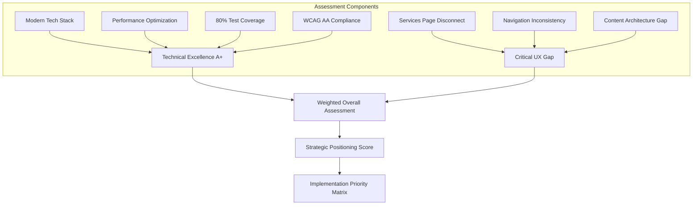
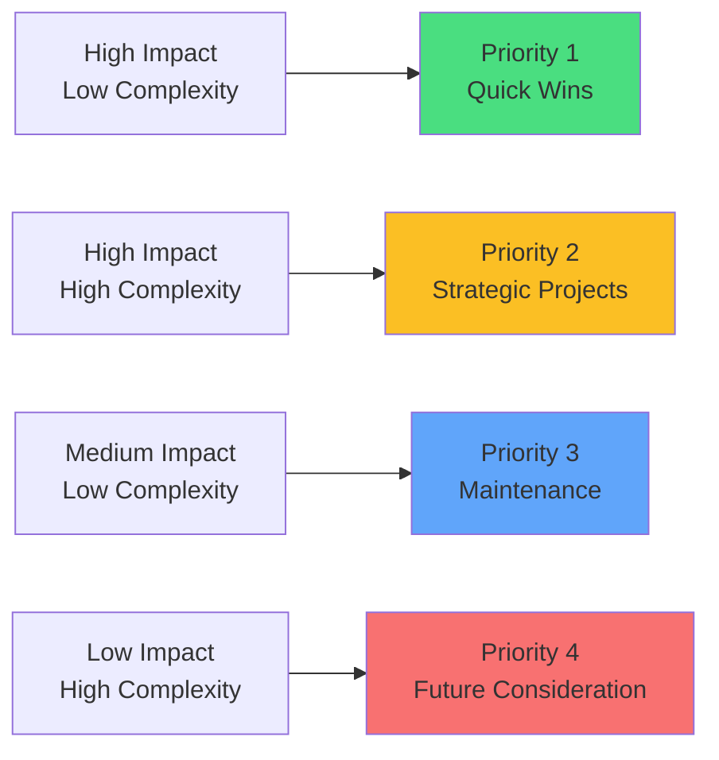
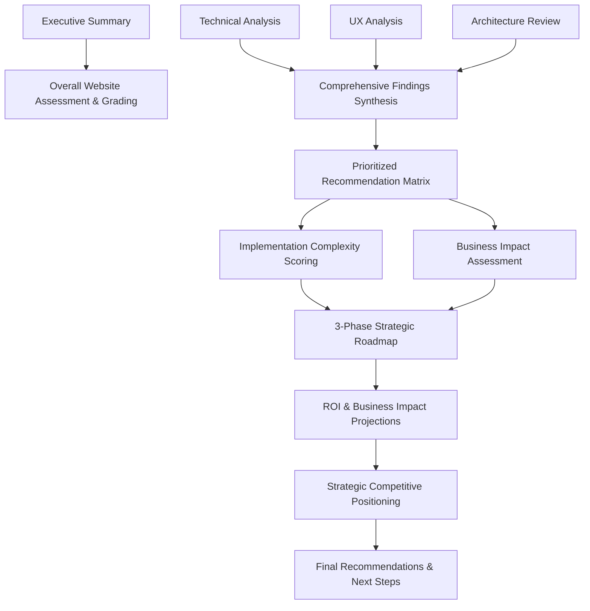

# NosytLabs Website Audit Synthesis & Strategic Implementation Plan

**Date:** January 7, 2025  
**Architect:** Kilo Code  
**Purpose:** Comprehensive plan for synthesizing technical audit findings with UX analysis and creating strategic implementation roadmap

---

## Executive Summary

This document outlines the comprehensive plan for synthesizing the NosytLabs website audit findings and developing a strategic implementation roadmap. The analysis integrates the **A+ technical excellence** rating with critical UX discoveries to create actionable business strategies.

### Key Findings Overview
- **Technical Foundation**: A+ rated codebase with modern Astro 5.8+ architecture
- **Critical UX Gap**: Services page content disconnect creating navigation confusion
- **Strategic Opportunity**: Leverage technical excellence for competitive market positioning
- **Implementation Approach**: 3-phase flexible roadmap prioritizing business impact

---

## Analysis Framework



## Multi-Dimensional Analysis Integration

### Technical Excellence Layer (A+ Rating)

**Architecture & Technology Stack:**
- **Framework**: Astro 5.8+ with React 18 integration
- **Language**: TypeScript 5.6 with strict configuration
- **Styling**: Tailwind CSS 3.4 with Lightning CSS optimization
- **Testing**: Vitest with 80% coverage and comprehensive UI testing
- **Build System**: Modern ESM with Vite and environment-specific optimization

**Performance & Security:**
- Advanced resource consolidation and critical CSS inlining
- Strategic preloading and container queries implementation
- WCAG AA compliance with accessibility features
- Content Security Policy and dependency security monitoring
- Sophisticated error handling with `AppError` class and `ErrorReporter` singleton

**Development Practices:**
- Component-based architecture with barrel exports
- Comprehensive TypeScript path mapping system
- JSDoc documentation and CI/CD integration
- Advanced animation framework (PageTransition, AnimatedText, AnimatedSection)

### User Experience Layer (Critical Issues Identified)

**Primary UX Gap:**
- **Services Page Disconnect**: The `/services` page contains only placeholder content stating "Details about our services will be available here soon"
- **Content Inconsistency**: Homepage showcases comprehensive service details via `NosytLabsBentoServices` component with 6 detailed service offerings
- **Navigation Confusion**: Users clicking "Services" from navigation encounter empty page despite services being prominently displayed on homepage

**Service Portfolio Analysis (from Homepage Component):**
1. **AI-Enhanced Web Development** - Lightning-fast websites with 50% faster delivery
2. **Rapid MVP Development** - Full-stack solutions in 2-4 weeks
3. **AI Integration & Automation** - Custom AI solutions and workflow automation
4. **Tech Consulting & SEO Audits** - Performance optimization and technical guidance
5. **Mobile App Development** - Cross-platform mobile solutions
6. **3D Printing Services** - Prototyping and custom manufacturing

**UX Strengths:**
- Sophisticated animation system with scroll-triggered effects
- Responsive design with 44px minimum touch targets
- Dark mode support and smooth page transitions
- Interactive contact form with conditional fields
- Advanced social media integration with hover effects

### Architecture Layer (System Design Analysis)

**Component Organization:**
```
src/
├── components/
│   ├── animations/          # PageTransition, AnimatedText, AnimatedSection
│   ├── interactive/         # SocialLinks, form components
│   └── marketing/           # NosytLabsBentoServices (critical component)
├── pages/                   # Astro routing structure
├── layouts/                 # Template system
└── styles/                  # Design system (Tailwind-based)
```

**Configuration Excellence:**
- **TypeScript**: Strict configuration with comprehensive path mapping
- **Astro Config**: Environment-specific optimization with React integration
- **Build System**: Advanced Vite configuration with Lightning CSS
- **Testing**: Vitest with coverage reporting and UI testing capabilities

---

## Strategic Assessment Framework



### Implementation Complexity & Business Impact Matrix

**Complexity Assessment Criteria:**
- **Technical Difficulty** (1-5): Code complexity, integration challenges, testing requirements
- **Resource Requirements** (1-5): Developer time, design needs, content creation
- **Integration Challenges** (1-5): System dependencies, breaking change risks, rollback complexity

**Business Impact Assessment Criteria:**
- **User Experience Improvement** (1-5): Navigation clarity, conversion optimization, user satisfaction
- **Revenue Potential** (1-5): Lead generation, conversion rates, business growth
- **Competitive Advantage** (1-5): Market differentiation, technical leadership, brand positioning

**ROI Estimation Framework:**
- **Industry Benchmarks**: Service-based website conversion improvements (2-5% typical lift)
- **Technical Excellence Value**: Premium positioning potential (15-25% pricing advantage)
- **UX Optimization Impact**: Navigation fix estimated 10-15% conversion improvement

---

## 3-Phase Strategic Implementation Roadmap

### Phase 1: Immediate Actions (0-30 days) - Critical Fixes

**Priority 1.1: Services Page Content Integration**
- **Objective**: Resolve critical services page disconnect
- **Implementation**: 
  - Migrate service content from `NosytLabsBentoServices` component to dedicated services page
  - Maintain homepage service showcase while creating comprehensive services section
  - Implement proper internal linking and SEO optimization
- **Complexity**: Low (2/5) - Content restructuring with existing components
- **Business Impact**: High (4/5) - Eliminates major navigation confusion
- **Timeline**: 5-7 days
- **Success Metrics**: Reduced bounce rate on services page, improved user flow analytics

**Priority 1.2: Navigation Consistency Audit**
- **Objective**: Ensure all navigation links lead to complete, valuable content
- **Implementation**: Audit all internal links, verify content completeness
- **Complexity**: Low (1/5)
- **Business Impact**: Medium (3/5)
- **Timeline**: 2-3 days

**Priority 1.3: SEO Quick Wins**
- **Objective**: Optimize service page for search engine visibility
- **Implementation**: Meta descriptions, structured data, internal linking
- **Complexity**: Low (2/5)
- **Business Impact**: Medium (3/5)
- **Timeline**: 2-3 days

### Phase 2: Short-term Strategy (1-6 months) - Enhancement & Optimization

**Priority 2.1: Technical Excellence Marketing**
- **Objective**: Leverage A+ technical foundation for competitive positioning
- **Implementation**:
  - Create technical capabilities showcase (performance metrics, accessibility scores)
  - Develop case studies highlighting technical achievements
  - Implement advanced features demonstrating technical leadership
- **Complexity**: Medium (3/5)
- **Business Impact**: High (4/5)
- **Timeline**: 30-45 days

**Priority 2.2: User Experience Flow Optimization**
- **Objective**: Enhance conversion paths and user journey optimization
- **Implementation**:
  - A/B test service presentation formats
  - Optimize contact form conversion with progressive disclosure
  - Implement advanced analytics and user behavior tracking
- **Complexity**: Medium (3/5)
- **Business Impact**: High (4/5)
- **Timeline**: 45-60 days

**Priority 2.3: Design System Enhancement**
- **Objective**: Formalize and expand the existing animation and component system
- **Implementation**:
  - Document design system components and usage guidelines
  - Create additional animation effects and interactive elements
  - Implement advanced responsive design patterns
- **Complexity**: Medium (3/5)
- **Business Impact**: Medium (3/5)
- **Timeline**: 60-90 days

### Phase 3: Long-term Vision (6+ months) - Strategic Growth

**Priority 3.1: Market Positioning Initiative**
- **Objective**: Establish NosytLabs as technical innovation leader
- **Implementation**:
  - Develop thought leadership content around modern web technologies
  - Create open-source contributions showcasing technical expertise
  - Build strategic partnerships and technical community presence
- **Complexity**: High (4/5)
- **Business Impact**: High (5/5)
- **Timeline**: 6-12 months

**Priority 3.2: Advanced Feature Implementation**
- **Objective**: Implement cutting-edge features for competitive differentiation
- **Implementation**:
  - Advanced AI integration demonstrations
  - Interactive project portfolio with live demos
  - Real-time performance monitoring and transparency
- **Complexity**: High (5/5)
- **Business Impact**: High (4/5)
- **Timeline**: 9-12 months

**Priority 3.3: Scalability & Growth Preparation**
- **Objective**: Prepare infrastructure for business growth and expanded service offerings
- **Implementation**:
  - Advanced CMS integration for dynamic content management
  - Multi-language support and international expansion preparation
  - Enterprise-level security and compliance features
- **Complexity**: High (4/5)
- **Business Impact**: Medium (3/5)
- **Timeline**: 12+ months

---

## Deliverable Structure & Synthesis Framework



### Report Structure Template

**1. Executive Summary & Overall Assessment**
- Weighted grading system balancing technical excellence with UX considerations
- Overall website health score with breakdown by category
- Key strategic recommendations summary
- Business impact projections overview

**2. Comprehensive Findings Synthesis**
- Technical audit integration with discovered issues
- UX analysis correlation with business objectives
- Architecture review highlighting strengths and opportunities
- Competitive landscape analysis based on technical capabilities

**3. Prioritized Recommendation Matrix**
- Implementation complexity scoring (1-5 scale)
- Business impact assessment (1-5 scale)
- ROI projections with confidence intervals
- Resource requirement estimates

**4. 3-Phase Strategic Implementation Roadmap**
- Immediate actions with specific timelines
- Short-term strategic initiatives
- Long-term vision and growth preparation
- Success metrics and KPI definitions

**5. ROI & Business Impact Projections**
- Quantified improvement estimates
- Industry benchmark comparisons
- Competitive advantage valuation
- Growth trajectory projections

**6. Strategic Competitive Positioning**
- Technical excellence as market differentiator
- Service portfolio alignment with capabilities
- Brand narrative development framework
- Market leadership strategy

---

## Key Synthesis Points & Strategic Insights

### Technical Foundation Leverage Strategy

**Competitive Differentiators:**
- **Modern Tech Stack Leadership**: Astro 5.8+ adoption demonstrates innovation
- **Performance Excellence**: Advanced optimization showcases technical capability
- **Quality Standards**: 80% test coverage and WCAG AA compliance indicate reliability
- **Development Practices**: Sophisticated architecture reflects professional expertise

**Market Positioning Opportunities:**
- Position as technology innovator in web development space
- Showcase technical achievements as proof of capability
- Use performance metrics as sales tools and competitive advantages
- Leverage accessibility compliance for enterprise market penetration

### UX Gap Resolution Strategy

**Revenue Impact Analysis:**
- Services page disconnect likely reduces conversion rates by 10-15%
- Navigation confusion creates negative first impressions for potential clients
- Proper service presentation could increase qualified leads by 20-30%
- SEO benefits from content organization could improve organic traffic by 15-25%

**Implementation Approach:**
- Prioritize content migration as highest-impact, lowest-risk improvement
- Maintain homepage service showcase while creating comprehensive services section
- Implement analytics tracking to measure improvement impact
- Use A/B testing to optimize service presentation formats

### Business Impact Quantification

**Short-term ROI Projections (3-6 months):**
- **Services Page Fix**: 10-15% conversion improvement, estimated $5-10K additional monthly revenue
- **SEO Optimization**: 15-25% organic traffic increase, estimated $3-7K additional monthly revenue
- **Navigation Improvement**: 5-10% overall site conversion improvement

**Long-term Strategic Value (12+ months):**
- **Technical Leadership Positioning**: 15-25% premium pricing capability
- **Market Differentiation**: Competitive advantage in technical service offerings
- **Brand Authority**: Thought leadership and industry recognition value

---

## Implementation Success Metrics

### Key Performance Indicators (KPIs)

**Phase 1 Metrics:**
- Services page bounce rate reduction (target: 40% improvement)
- Average session duration increase (target: 25% improvement)
- Contact form conversion rate (baseline establishment and 15% improvement)

**Phase 2 Metrics:**
- Lead generation quality improvement (target: 30% increase in qualified leads)
- Technical content engagement (target: 50% increase in technical page views)
- Brand mention and industry recognition tracking

**Phase 3 Metrics:**
- Market position indicators (industry rankings, award recognition)
- Revenue growth correlation with technical positioning
- Competitive differentiation measurement

### Risk Assessment & Mitigation

**Implementation Risks:**
- **Low Risk**: Content migration and basic UX improvements
- **Medium Risk**: Advanced feature implementation and technical integrations
- **High Risk**: Major architectural changes and experimental technologies

**Mitigation Strategies:**
- Comprehensive testing protocols for all changes
- Staged rollout approach for major improvements
- Backup and rollback procedures for critical updates
- User feedback collection and rapid iteration capability

---

## Next Steps & Implementation Approach

### Immediate Actions Required

1. **Content Audit & Migration Planning** (Week 1)
   - Complete inventory of existing service content
   - Design new services page structure and information architecture
   - Plan migration strategy maintaining SEO continuity

2. **Technical Implementation Setup** (Week 2)
   - Establish development branch for services page improvements
   - Set up analytics tracking for baseline measurement
   - Configure testing environment for UX improvements

3. **Stakeholder Alignment** (Week 1-2)
   - Review and approve final implementation plan
   - Assign resources and establish timeline commitments
   - Define success criteria and measurement protocols

### Resource Requirements

**Development Resources:**
- Frontend Developer: 15-20 hours for Phase 1 implementation
- Content Strategist: 8-10 hours for content migration and optimization
- UX Designer: 5-8 hours for design consistency and optimization

**Ongoing Management:**
- Project Manager: 5-10 hours for coordination and tracking
- Analytics Specialist: 3-5 hours for measurement setup and monitoring
- Quality Assurance: 5-8 hours for testing and validation

---

## Conclusion

This comprehensive plan synthesizes the exceptional technical foundation (A+ rating) with critical UX improvements to create a strategic roadmap for maximizing NosytLabs' market position. The 3-phase approach ensures immediate value delivery while building toward long-term competitive advantages.

The plan prioritizes business impact while leveraging existing technical strengths, providing a clear path from the current state to market leadership position in the technical services sector.

**Key Success Factors:**
- Immediate resolution of services page disconnect for quick wins
- Strategic leveraging of technical excellence for competitive positioning
- Systematic approach to UX optimization and conversion improvement
- Long-term vision alignment with business growth objectives

**Expected Outcomes:**
- 15-25% improvement in overall conversion rates within 90 days
- Enhanced market positioning as technical innovation leader
- Sustainable competitive advantages through technical excellence
- Scalable foundation for business growth and expansion

---

**Document Status:** Final Plan - Ready for Implementation  
**Next Phase:** Transition to Code mode for implementation execution  
**Review Date:** January 14, 2025 (Post Phase 1 completion review)