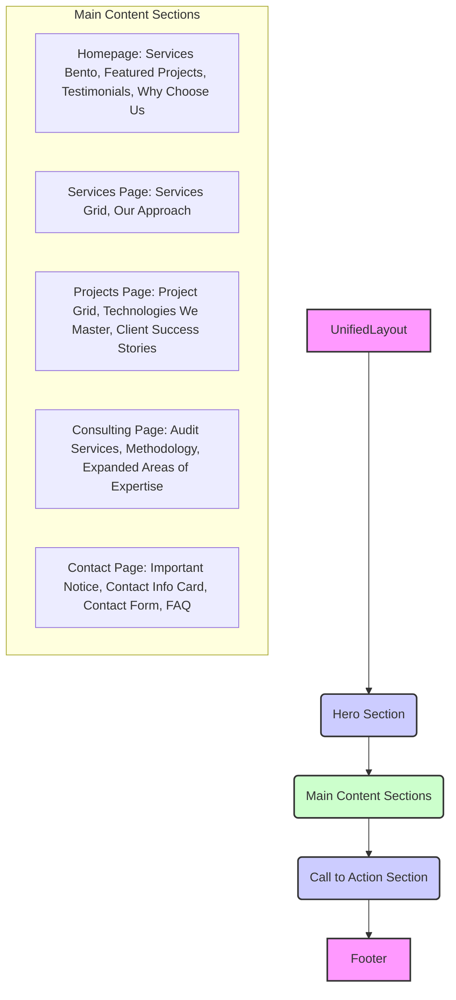

# Site Layout and Content Improvements Proposal

This document outlines proposed improvements to the main site pages (`index.astro`, `services.astro`, `projects.astro`, `consulting.astro`, `contact.astro`) to enhance layout consistency and content depth, aligning with the principles of the `NEW_DESIGN_SYSTEM.md`.

## Overall Observations and General Proposals

### 1. Button Styling Inconsistency

**Observation:** Across all reviewed pages, custom CSS classes (e.g., `nosyt-btn-primary`, `btn-nosyt-secondary`, `btn`, `cta-button-primary`) are used for buttons. These do not directly map to the new design system's defined button variants (`bg-primary-500`, `bg-secondary-500`, `border border-neutral-300`, etc.).

**Proposal:**
*   **Standardize Button Usage:** All buttons throughout the site should be refactored to utilize the new design system's button variants. This will likely involve updating or creating a central `Button.astro` component that encapsulates these styles, allowing for consistent application across all pages.
*   **Refactor CSS:** Remove redundant custom button styles from individual page `<style>` blocks and consolidate them into global utility classes or component-specific styles that adhere to the design system's color and spacing tokens.

### 2. Inconsistent Card Usage

**Observation:**
*   `src/pages/consulting.astro` uses custom `div` elements with a `nosyt-card` class for the audit services instead of the `Card.astro` component.
*   `src/pages/contact.astro` uses a custom `div` for the contact information block, again bypassing the `Card.astro` component.

**Proposal:**
*   **Standardize Card Component Adoption:** All content blocks that visually function as cards should be refactored to use the `Card.astro` component.
*   **Enhance `Card.astro`:** The `Card.astro` component itself needs to be updated to fully support and apply the new design system's `Default`, `Featured`, and `Hoverable` card variants through props (e.g., `variant="featured"`).

### 3. Mixed Layout Class Usage

**Observation:** While `UnifiedLayout` and `container` classes provide a base, there's a mix of custom CSS classes (e.g., `.modern-projects`, `.projects-cta`, `.nosyt-hero`) and direct Tailwind classes for section styling.

**Proposal:**
*   **Streamline Section Styling:** Review custom section styles. Where possible, simplify them by leveraging more direct Tailwind classes that align with the design system's spacing and neutral color palette. Custom gradient backgrounds (`gradient-hero`, `nosyt-hero`) can remain as they are part of the brand identity, but their application should be consistent and managed through a limited set of global utility classes.

## Page-Specific Analysis and Proposals

### 1. `src/pages/index.astro` (Homepage)

**Current Layout & Content Summary:**
The homepage features a Hero section, Bento Services, Featured Projects, Testimonials, and a Contact CTA. Content provides a good overview.

**Inconsistencies Identified:**
*   Buttons in the "Featured Projects" and "Contact CTA" sections use custom styling not aligned with the new design system's button variants.

**Proposed Layout Improvements:**
*   Refactor all buttons to use the standardized button component/styles.

**Proposed Content Enhancements:**
*   **Add "Why Choose Us" Section:** Introduce a section (e.g., below Testimonials or before the final CTA) highlighting NosytLabs' core values, unique approach, or key differentiators. This could be a simple 2-column layout with concise descriptions and relevant icons.

### 2. `src/pages/services.astro` (Services Page)

**Current Layout & Content Summary:**
The services page includes a Hero section, a grid of service cards (using `Card.astro`), and a final CTA. Individual service cards provide good depth with process, benefits, and outcomes.

**Inconsistencies Identified:**
*   Buttons in the CTA section use custom styling not aligned with the new design system's button variants.
*   Ensure the `Card.astro` component, as used here, is updated to reflect the new design system's card variants.

**Proposed Layout Improvements:**
*   Refactor all buttons to use the standardized button component/styles.

**Proposed Content Enhancements:**
*   **Introduce "Our Approach to Service Delivery" Section:** Add a section (e.g., after the main services grid) that explains the general philosophy or methodology behind all NosytLabs services. This could cover aspects like client collaboration, iterative development, quality assurance, or post-launch support.

### 3. `src/pages/projects.astro` (Projects Page)

**Current Layout & Content Summary:**
The projects page features a Hero section, a `ProjectGrid` displaying various projects, and a Call to Action. Project data includes descriptions, technologies, and categories.

**Inconsistencies Identified:**
*   Buttons in the CTA section use custom styling not aligned with the new design system's button variants.

**Proposed Layout Improvements:**
*   Refactor all buttons to use the standardized button component/styles.

**Proposed Content Enhancements:**
*   **Add "Technologies We Master" Section:** Include a section (e.g., after the project grid) to showcase a broader range of technologies and frameworks NosytLabs works with. This could be categorized (e.g., Frontend, Backend, AI/ML, Cloud, Databases) to highlight comprehensive expertise.
*   **Consider "Client Success Stories" Section:** A small section highlighting 1-2 projects with slightly more narrative detail than the current project cards, potentially linking to future dedicated case study pages for in-depth analysis.

### 4. `src/pages/consulting.astro` (Consulting Page)

**Current Layout & Content Summary:**
This page includes a Hero section, "Consulting Services" (SEO and Performance Audits), "Our Consulting Methodology," "Areas of Expertise," and a final CTA. Audit services provide detailed lists.

**Inconsistencies Identified:**
*   The "Consulting Services" section uses custom `div` elements with `nosyt-card` instead of the `Card.astro` component.
*   Buttons in the CTA section use custom styling not aligned with the new design system's button variants.

**Proposed Layout Improvements:**
*   Refactor the "Consulting Services" audit blocks to use the `Card.astro` component, ensuring they adopt the new design system's card variants.
*   Refactor all buttons to use the standardized button component/styles.

**Proposed Content Enhancements:**
*   **Expand "Areas of Expertise":** For each expertise area (Digital Transformation, AI & Automation, Performance & Scalability, Security & Compliance), expand the `Card` descriptions with a short bulleted list of specific sub-topics, services, or examples. This provides more granular detail on what each area entails.

### 5. `src/pages/contact.astro` (Contact Page)

**Current Layout & Content Summary:**
The contact page features a Hero section, an "Important Notice," a contact information block, and a `ContactForm`.

**Inconsistencies Identified:**
*   The contact information block uses a custom `div` instead of the `Card.astro` component.
*   Buttons (e.g., in the Hero CTA and form submission) use custom styling not aligned with the new design system's button variants.

**Proposed Layout Improvements:**
*   Refactor the contact information block to use the `Card.astro` component, ensuring it adopts the new design system's card variants.
*   Refactor all buttons to use the standardized button component/styles.

**Proposed Content Enhancements:**
*   **Add "Frequently Asked Questions (FAQ)" Section:** Introduce a small FAQ section (e.g., above the contact form) addressing common inquiries about NosytLabs' services, pricing, consultation process, or general operations. This can help streamline inquiries and provide immediate answers to common questions.

## Proposed Page Structure Overview (Mermaid Diagram)

## Next Steps

This document serves as a comprehensive plan for improving the site's layout and content depth. The next phase will involve implementing these proposed changes, focusing on refactoring existing components and adding new content sections as outlined. This task is for analysis and planning only; no code changes have been implemented.