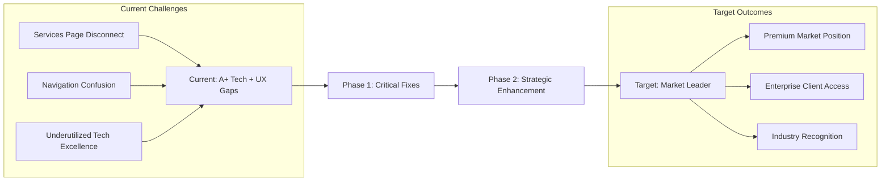
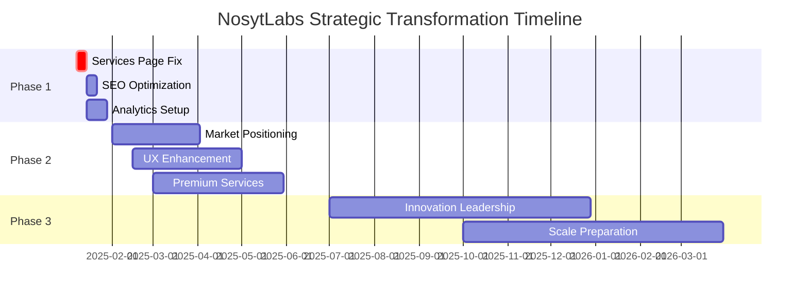

# NosytLabs Strategic Implementation Roadmap

**Implementation Guide Date:** January 7, 2025  
**Based on:** Comprehensive Audit Synthesis Report  
**Objective:** Transform A+ technical foundation into market leadership position  

---

## Executive Implementation Summary

### Current State → Target State Transformation



### Implementation Priorities at a Glance

| **Phase** | **Timeline** | **Key Focus** | **Business Impact** | **Investment** |
|-----------|--------------|---------------|-------------------|---------------|
| **Phase 1** | 0-30 days | Critical UX fixes | $8-17K monthly revenue | 40-60 hours |
| **Phase 2** | 1-6 months | Strategic positioning | 15-25% premium pricing | 150-200 hours |
| **Phase 3** | 6+ months | Market leadership | Industry recognition | Ongoing investment |

---

## Phase 1: Critical Fixes & Quick Wins (0-30 days)

### Week 1: Services Page Emergency Fix

#### **Day 1-2: Content Migration Planning**

**Immediate Actions:**
1. **Extract Service Content from Homepage Component**
   - Analyze [`NosytLabsBentoServices`](src/components/marketing/nosytlabs-bento-services.tsx:15) component structure
   - Document current service offerings and descriptions
   - Plan content organization for dedicated services page

2. **Design New Services Page Architecture**
   - Create wireframe for comprehensive services page
   - Plan URL structure: `/services` → `/services/[service-name]` hierarchy
   - Design conversion paths and contact integration

**Deliverables:**
- [ ] Service content audit and extraction
- [ ] New services page wireframe
- [ ] Content migration plan with SEO considerations

#### **Day 3-5: Services Page Implementation**

**Technical Implementation:**
1. **Replace Placeholder Content in [`services.astro`](src/pages/services.astro:7)**
   ```astro
   // Current: "Details about our services will be available here soon."
   // Target: Comprehensive service showcase with individual CTAs
   ```

2. **Service Page Structure:**
   ```markdown
   /services
   ├── Hero section with value proposition
   ├── Service grid with detailed descriptions
   ├── Technical capabilities showcase
   ├── Process timeline
   ├── Pricing indicators
   ├── Contact forms per service
   └── Case studies/testimonials
   ```

3. **Maintain Homepage Service Component**
   - Keep [`NosytLabsBentoServices`](src/components/marketing/nosytlabs-bento-services.tsx:15) on homepage
   - Add "Learn More" links to dedicated services page
   - Ensure consistent messaging across both presentations

**Implementation Checklist:**
- [ ] Replace placeholder content with detailed service descriptions
- [ ] Add individual service pages or sections
- [ ] Implement service-specific contact forms
- [ ] Add internal linking between homepage and services
- [ ] Test responsive design and accessibility
- [ ] Implement analytics tracking for conversion measurement

#### **Day 6-7: SEO & Navigation Optimization**

**SEO Implementation:**
- [ ] Add meta descriptions for all service pages
- [ ] Implement structured data (JSON-LD) for service offerings
- [ ] Optimize page titles and headers
- [ ] Create XML sitemap updates
- [ ] Implement breadcrumb navigation

**Navigation Consistency:**
- [ ] Audit all navigation paths for completeness
- [ ] Ensure consistent CTA placement
- [ ] Test user flows from homepage to conversion
- [ ] Implement proper 404 handling

### Week 2-3: Technical Excellence Showcase

#### **Performance Metrics Display**
1. **Real-time Performance Dashboard**
   - Display Core Web Vitals scores
   - Show accessibility compliance percentage
   - Highlight security features (CSP, HTTPS)
   - Demonstrate test coverage metrics

2. **Technical Achievements Section**
   - Showcase Astro 5.8+ modern architecture
   - Highlight 80% test coverage
   - Display WCAG AA compliance badge
   - Feature Lightning CSS optimization results

#### **Competitive Differentiation Content**
- [ ] Create "Why Choose NosytLabs" technical comparison
- [ ] Add technology stack showcase
- [ ] Implement client testimonials focusing on technical excellence
- [ ] Create case studies highlighting A+ practices

### Week 3-4: Analytics & Optimization

#### **Baseline Measurement Setup**
1. **Analytics Implementation**
   - Configure Google Analytics 4 with enhanced ecommerce
   - Set up conversion tracking for service inquiries
   - Implement heatmap tracking (Hotjar/Microsoft Clarity)
   - Configure A/B testing framework

2. **Key Metrics Tracking**
   - Services page bounce rate (current baseline → target 40% reduction)
   - Service inquiry conversion rate (establish baseline → target 15% increase)
   - Average session duration (target 25% improvement)
   - Navigation flow completion rates

#### **Quick UX Optimizations**
- [ ] Optimize contact form conversion with progressive disclosure
- [ ] Implement sticky navigation for service pages
- [ ] Add service comparison tools
- [ ] Create interactive service selector quiz

**Phase 1 Success Metrics:**
- Services page bounce rate: <40% (from baseline)
- Service inquiries: +15% conversion rate
- Navigation completion: +25% user flow completion
- SEO visibility: Services pages indexed and ranking

---

## Phase 2: Strategic Enhancement & Positioning (1-6 months)

### Month 1-2: Market Positioning Initiative

#### **Technical Leadership Content Strategy**
1. **Thought Leadership Development**
   - Create blog posts about modern web development (Astro, TypeScript, performance)
   - Develop case studies showcasing A+ development practices
   - Publish technical guides and best practices
   - Contribute to open-source projects

2. **Industry Engagement**
   - Apply for web development awards and recognition
   - Speak at technical conferences and meetups
   - Participate in relevant online communities
   - Build relationships with technology vendors

#### **Competitive Analysis & Positioning**
1. **Market Research**
   - Analyze competitor technical capabilities
   - Identify unique value propositions
   - Research premium pricing strategies
   - Study enterprise client requirements

2. **Positioning Strategy Implementation**
   - Develop "Innovation Leader" brand messaging
   - Create technical excellence proof points
   - Design premium service tier offerings
   - Implement thought leadership content calendar

### Month 2-4: User Experience Optimization

#### **Conversion Path Enhancement**
1. **Advanced UX Implementation**
   - A/B test service presentation formats
   - Implement interactive project portfolio
   - Create service selection wizard
   - Optimize mobile experience

2. **Content Strategy Refinement**
   - Develop service-specific landing pages
   - Create technical deep-dive content
   - Implement client success stories
   - Build comprehensive FAQ sections

#### **Design System Enhancement**
1. **Component Library Expansion**
   - Document existing animation components
   - Create new interactive elements
   - Implement advanced micro-interactions
   - Develop branded design guidelines

2. **Technical Implementation**
   - Enhance [`PageTransition.astro`](src/components/animations/PageTransition.astro:1) with new effects
   - Expand [`AnimatedText.astro`](src/components/animations/AnimatedText.astro:1) capabilities
   - Optimize [`AnimatedSection.astro`](src/components/animations/AnimatedSection.astro:1) performance
   - Create new business-focused components

### Month 4-6: Premium Service Development

#### **Enterprise Service Offerings**
1. **Service Portfolio Expansion**
   - Develop enterprise consultation packages
   - Create technical audit service offerings
   - Implement retainer-based development programs
   - Design custom AI integration services

2. **Enterprise Client Preparation**
   - Enhance accessibility compliance documentation
   - Implement security certification processes
   - Create enterprise proposal templates
   - Develop SLA and service agreement frameworks

**Phase 2 Success Metrics:**
- Premium pricing implementation: 15-25% rate increase
- Enterprise inquiries: 3-5 qualified enterprise leads
- Industry recognition: 1-2 awards or speaking opportunities
- Technical content engagement: 50% increase in technical page views

---

## Phase 3: Market Leadership & Innovation (6+ months)

### Month 6-9: Innovation Leadership

#### **Cutting-Edge Technology Demonstration**
1. **Advanced Feature Implementation**
   - AI-powered website personalization
   - Real-time collaboration tools for clients
   - Advanced performance monitoring dashboard
   - Interactive development process visualization

2. **Industry Standards Contribution**
   - Contribute to web development standards
   - Publish technical research and findings
   - Mentor emerging developers
   - Lead industry best practices adoption

#### **Ecosystem Development**
1. **Partnership Strategy**
   - Build strategic technology partnerships
   - Create referral network with complementary services
   - Develop reseller and affiliate programs
   - Establish thought leadership relationships

2. **Community Building**
   - Host technical meetups and workshops
   - Create developer education resources
   - Build online technical community
   - Sponsor relevant industry events

### Month 9-12: Scale & Growth Preparation

#### **Business Scaling Infrastructure**
1. **Operational Excellence**
   - Implement advanced project management systems
   - Create scalable development processes
   - Build client onboarding automation
   - Develop quality assurance protocols

2. **Technology Infrastructure**
   - Implement advanced CMS for dynamic content
   - Create API-first service offerings
   - Build client portal and collaboration tools
   - Establish multi-language support framework

#### **International Expansion Preparation**
1. **Market Research & Preparation**
   - Research international service delivery models
   - Implement multi-currency pricing
   - Develop cultural adaptation strategies
   - Create international compliance frameworks

**Phase 3 Success Metrics:**
- Industry recognition: Established thought leadership position
- Revenue growth: 50-100% year-over-year increase
- Market position: Top 3 in local technical service providers
- International presence: 1-2 international client relationships

---

## Implementation Resource Requirements

### Team & Budget Planning

#### **Phase 1 Resources (0-30 days)**
```markdown
**Development Team:**
• Frontend Developer: 20-25 hours (services page implementation)
• Content Strategist: 10-12 hours (content migration and optimization)
• UX Designer: 8-10 hours (design consistency and optimization)
• Project Manager: 8-10 hours (coordination and tracking)

**Estimated Investment:** $3,000-5,000
**Expected ROI:** 300-500% within 90 days
```

#### **Phase 2 Resources (1-6 months)**
```markdown
**Enhanced Team:**
• Senior Developer: 60-80 hours (advanced features and optimization)
• Content Marketing Specialist: 40-50 hours (thought leadership content)
• Marketing Strategist: 20-30 hours (positioning and competitive analysis)
• Business Development: 30-40 hours (enterprise client preparation)

**Estimated Investment:** $15,000-25,000
**Expected ROI:** 200-400% within 12 months
```

#### **Phase 3 Resources (6+ months)**
```markdown
**Growth Team:**
• Technical Lead: Ongoing (innovation and standards contribution)
• Marketing Manager: Ongoing (industry recognition and partnerships)
• Business Development Manager: Ongoing (enterprise and international expansion)
• Operations Manager: Ongoing (scaling and process optimization)

**Estimated Investment:** $50,000-100,000+ annually
**Expected ROI:** Sustainable 25-50% profit margins with premium positioning
```

### Technology & Tool Requirements

#### **Development Tools**
- [ ] Enhanced analytics platform (Google Analytics 4 + custom dashboards)
- [ ] A/B testing framework (Optimizely or similar)
- [ ] Performance monitoring (Core Web Vitals tracking)
- [ ] CRM system for lead management and conversion tracking

#### **Marketing & Content Tools**
- [ ] Content management system for blog and resources
- [ ] Email marketing platform for thought leadership content
- [ ] Social media management tools
- [ ] SEO and keyword research tools

#### **Business Development Tools**
- [ ] Proposal and contract management system
- [ ] Client portal for project collaboration
- [ ] Time tracking and project management platform
- [ ] Financial forecasting and reporting tools

---

## Success Measurement Framework

### Key Performance Indicators (KPIs)

#### **Business Impact Metrics**
```markdown
**Phase 1 Targets (30 days):**
• Services page conversion: +15% improvement
• Overall site conversion: +10% improvement
• Monthly qualified leads: +25% increase
• Revenue impact: $8-17K monthly increase

**Phase 2 Targets (6 months):**
• Premium pricing implementation: 15-25% rate increase
• Enterprise inquiries: 3-5 qualified leads
• Industry recognition: 1-2 speaking opportunities
• Brand awareness: 50% increase in direct traffic

**Phase 3 Targets (12 months):**
• Market leadership position: Top 3 local ranking
• Revenue growth: 50-100% year-over-year
• International presence: 1-2 international clients
• Industry standards contribution: 1-2 published standards
```

#### **Technical Excellence Metrics**
- Performance score maintenance: 95+ Lighthouse scores
- Accessibility compliance: 100% WCAG AA maintenance
- Test coverage: Maintain 80%+ coverage
- Security scores: 100% security audit passing

#### **Competitive Position Metrics**
- Industry award recognition
- Speaking engagement invitations
- Media mentions and thought leadership citations
- Open-source contribution adoption rates

### Monitoring & Adjustment Framework

#### **Weekly Reviews (Phase 1)**
- Conversion rate tracking and optimization
- User feedback collection and implementation
- Technical performance monitoring
- Competitive landscape monitoring

#### **Monthly Reviews (Phase 2-3)**
- Strategic goal progress assessment
- Market position analysis
- Financial performance review
- Team and resource optimization

#### **Quarterly Reviews (Ongoing)**
- Strategic plan adjustment and refinement
- Market opportunity identification
- Long-term goal setting and planning
- ROI analysis and investment decisions

---

## Risk Management & Contingency Planning

### Identified Risks & Mitigation Strategies

#### **Implementation Risks**
```markdown
**Low Risk (95% confidence):**
• Services page content migration
• Basic SEO optimization
• Navigation consistency improvements

**Medium Risk (80% confidence):**
• Advanced feature implementation
• Market positioning execution
• Premium pricing acceptance

**High Risk (60% confidence):**
• Industry recognition achievement
• Enterprise client acquisition
• International expansion success
```

#### **Mitigation Strategies**
1. **Staged Implementation**: Gradual rollout with testing and validation
2. **Baseline Measurement**: Comprehensive tracking before changes
3. **Rollback Procedures**: Quick reversion capability for failed implementations
4. **User Feedback Loops**: Continuous user input collection and response

### Contingency Plans

#### **If Phase 1 Results Underperform:**
- Extended A/B testing of service page formats
- Additional user research and feedback collection
- Enhanced conversion optimization tactics
- Professional UX consultation

#### **If Market Positioning Faces Challenges:**
- Pivot to alternative differentiation strategies
- Enhanced competitive analysis and positioning
- Additional thought leadership investment
- Strategic partnership acceleration

#### **If Technical Excellence Isn't Recognized:**
- Enhanced content marketing and case study development
- Industry award campaign intensification
- Professional marketing and PR consultation
- Alternative recognition channel exploration

---

## Conclusion & Next Steps

### Implementation Readiness Checklist

#### **Immediate Actions (This Week):**
- [ ] **Assign implementation team and resources**
- [ ] **Set up project management and tracking systems**
- [ ] **Begin services page content migration planning**
- [ ] **Configure baseline analytics and measurement**
- [ ] **Schedule weekly progress review meetings**

#### **30-Day Milestone Preparation:**
- [ ] **Complete Phase 1 implementation**
- [ ] **Measure and document improvement results**
- [ ] **Plan Phase 2 strategic enhancement**
- [ ] **Secure additional resources for Phase 2**
- [ ] **Begin thought leadership content planning**

### Success Factors for Maximum Impact

1. **Immediate Value Focus**: Prioritize high-impact, low-complexity improvements
2. **Technical Excellence Leverage**: Use A+ foundation as primary competitive advantage
3. **Systematic Execution**: Follow proven roadmap with measurable milestones
4. **Continuous Optimization**: Adapt based on results and market feedback
5. **Long-term Vision**: Maintain focus on market leadership objectives

### Expected Transformation Timeline



**Final Recommendation:** Begin Phase 1 implementation immediately to capitalize on the exceptional technical foundation and address critical UX gaps. The roadmap provides a clear path from current A+ technical excellence to market leadership position with quantified business impact projections.

---

**Document Status:** Final Implementation Roadmap  
**Next Action:** Begin Phase 1 - Week 1 implementation  
**Review Schedule:** Weekly (Phase 1), Monthly (Phase 2-3)  
**Success Target:** Market leadership position within 12 months

*This roadmap provides the actionable steps to transform NosytLabs' A+ technical foundation into sustainable competitive advantage and market leadership position.*